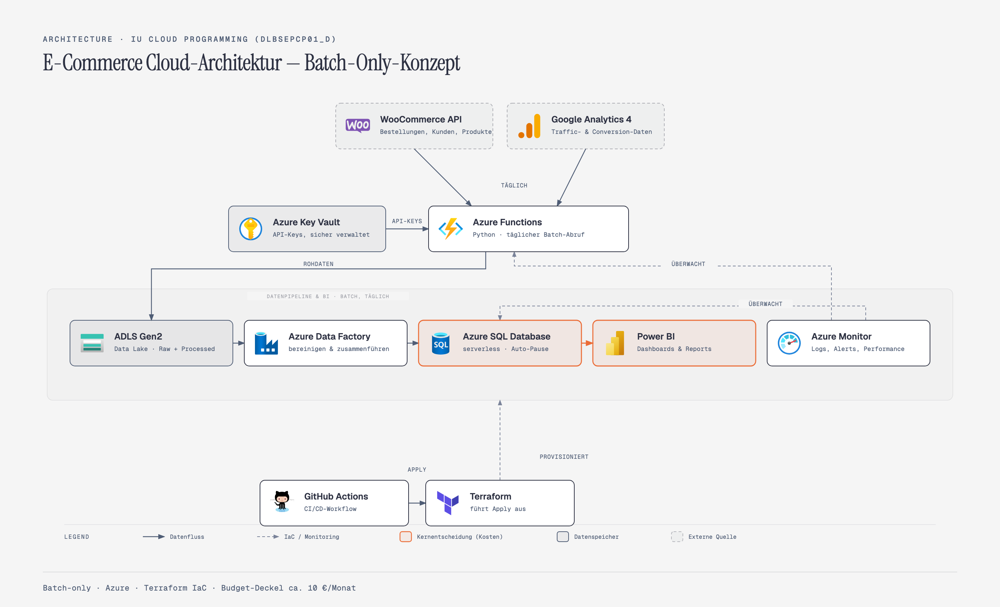

# Cloud E-Commerce Analytics

End-to-end Cloud-Datenpipeline auf Microsoft Azure für einen realen Online-Shop für Wohn- und Lifestyleprodukte ([luandla.de](https://luandla.de/)). Shop-, Website- und Suchdaten werden täglich per API abgerufen, in Azure gespeichert, bereinigt und in Power BI ausgewertet.

Portfolio-Projekt im Kurs **Cloud Programming** (IU, DLBSEPCP01_D).

## Ziel

- **Fachlich:** Verkäufe, Website-Traffic und Google-Suche in einem gemeinsamen Datenmodell zusammenführen, um Fragen wie diese zu beantworten: Welche Produkte und Kategorien verkaufen sich? Über welche Kanäle kommen Besucher in den Shop? Mit welchen Suchbegriffen wird der Shop bei Google gefunden?
- **Technisch:** Eine Cloud-Architektur mit Azure-Diensten aufbauen – Datenspeicherung, Orchestrierung, Secret-Management, Monitoring und Infrastructure as Code – im Batch-Betrieb und mit einem Budget von rund 10 € pro Monat.

## Datenquellen

| Quelle | Schnittstelle | Inhalt |
|---|---|---|
| WooCommerce | REST API | Bestellungen, Bestellpositionen, Produkte, Kategorien (Kunden werden aus den Rechnungsdaten der Bestellungen abgeleitet) |
| Google Analytics 4 | GA4 Data API | Tägliche Berichte: Traffic nach Kanal, Events, Landingpages, Seitenaufrufe, Zielgruppe |
| Google Search Console | Search Console API | Suchleistung pro Tag: Suchanfragen, Seiten, Impressionen, Klicks, Klickrate, Position |

## Technologien

Python · Azure SQL Database (serverless) · Azure Data Lake Storage Gen2 · Azure Data Factory · Azure Functions · Azure Key Vault · Azure Monitor · Terraform · GitHub Actions · Power BI

## Architektur

Architekturkonzept aus der Konzeptionsphase (Quelle: [docs/architecture_concept.html](docs/architecture_concept.html)).

**Ergänzung in der Umsetzung: Google Search Console API.** Zusätzlich zu WooCommerce und GA4 wird die Search Console als dritte Datenquelle geladen. Sie liefert die Suchleistung der Website in der Google-Suche: Suchanfragen, Seiten, Impressionen, Klicks, Klickrate und durchschnittliche Position pro Tag, Land und Gerät. Damit ergänzt sie die SEO-Sicht, die GA4 allein nicht abdeckt: welche Suchbegriffe Besucher in den Shop bringen. Der Zugriff läuft über dasselbe Google-Cloud-Dienstkonto wie bei GA4, sodass kein zusätzlicher Dienst und keine zusätzlichen Kosten entstehen.

## Struktur

- `data/` – Python-Extraktionsskripte (`extract_*.py`): rufen WooCommerce (Bestellungen inkl. Bestellpositionen, Produkte, Kategorien), GA4 und Google Search Console per API ab und speichern die Rohdaten als JSON im Data Lake (Container `raw`); Azure Data Factory lädt sie ins Schema `raw` (Full Refresh)
- `sql/` – SQL-Skripte für Azure SQL Database: Schemas `raw`, `staging`, `mart`, die Tabellen der Raw-Schicht und die Views der Staging-Schicht (Bereinigung, eine View pro Raw-Tabelle)
- `adf/` – Azure Data Factory (per Git-Integration aus dem Portal gespeichert): Pipelines, Datasets und verknüpfte Dienste als JSON; die Pipelines laden die JSON-Dateien aus dem Data Lake ins Schema `raw`
- Transformationen in Azure SQL: `raw` → `staging` (Bereinigung, Views) → `mart` (Dimensionen und Fakten für Power BI, Tabellen); Staging ist umgesetzt, der Mart wird per Stored Procedures befüllt und von Azure Data Factory gestartet *(geplant)*
- `terraform/` – Infrastructure as Code: Azure-Ressourcen (Resource Group, SQL Server, Datenbank, Function App) *(geplant)*
- `function_app/` – Azure Functions (Python): automatisierter, zeitgesteuerter Ablauf der Extraktionsskripte *(geplant)*
- `docs/` – Tabellendesign, Pipeline-Anleitung (`pipeline_guide.md`) und Projektlog
- `.env.example` – Vorlage für die Zugangsdaten; die echten Werte stehen in `.env` (nicht im Repository)

## Status

- Phase 1 (Konzeption): abgeschlossen
- Phase 2 (Umsetzung): in Arbeit
