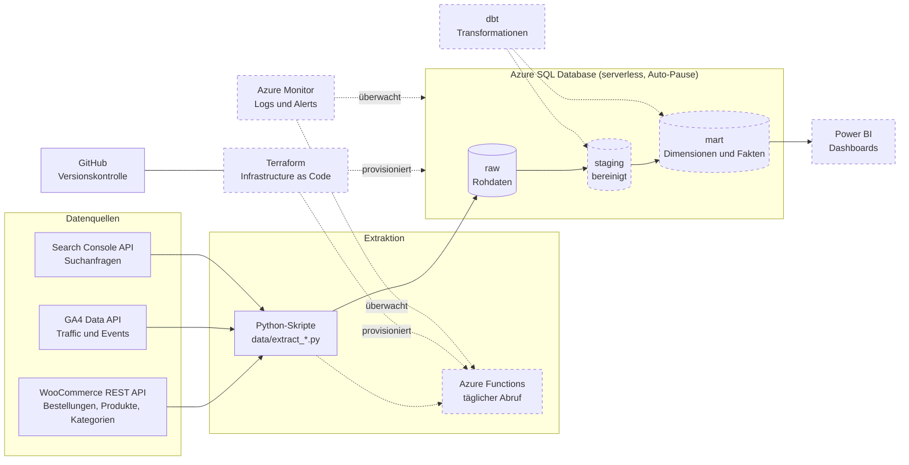

# cloud-ecommerce-analytics

End-to-end Cloud-Datenpipeline für WooCommerce + GA4 → Azure → Power BI
(IU Cloud Programming Portfolio, DLBSEPCP01_D)

## Architektur

Batch-Pipeline auf Azure, ausgelegt auf ein Budget von rund 10 € pro Monat. Gestrichelt = geplant.

## Struktur

- `data/` – Python-Extraktionsskripte (`extract_*.py`): laden WooCommerce (Bestellungen, Bestellpositionen, Produkte, Kategorien), GA4 und Google Search Console per API und schreiben die Rohdaten ins Schema `raw` (Full Refresh)
- `sql/` – SQL-Skripte für Azure SQL Database: Schemas `raw`, `staging`, `mart` und die Tabellen der Raw-Schicht
- `dbt/` – Transformationsmodelle: `staging` (Bereinigung) → `mart` (Dimensionen und Fakten für Power BI) *(geplant)*
- `terraform/` – Infrastructure as Code: Azure-Ressourcen (Resource Group, SQL Server, Datenbank, Function App) *(geplant)*
- `function_app/` – Azure Functions (Python): automatisierter, zeitgesteuerter Ablauf der Extraktionsskripte *(geplant)*
- `docs/` – Tabellendesign und Projektlog
- `.env.example` – Vorlage für die Zugangsdaten; die echten Werte stehen in `.env` (nicht im Repository)

## Status

- Phase 1 (Konzeption): abgeschlossen
- Phase 2 (Umsetzung): in Arbeit
