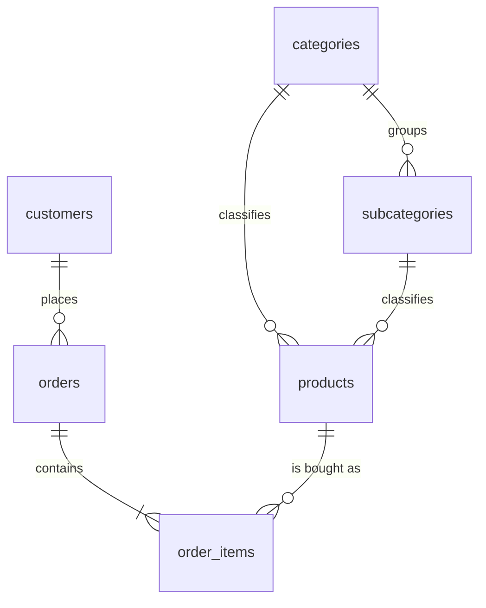
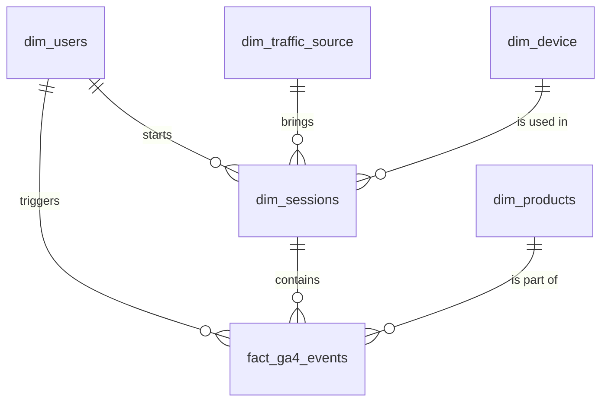
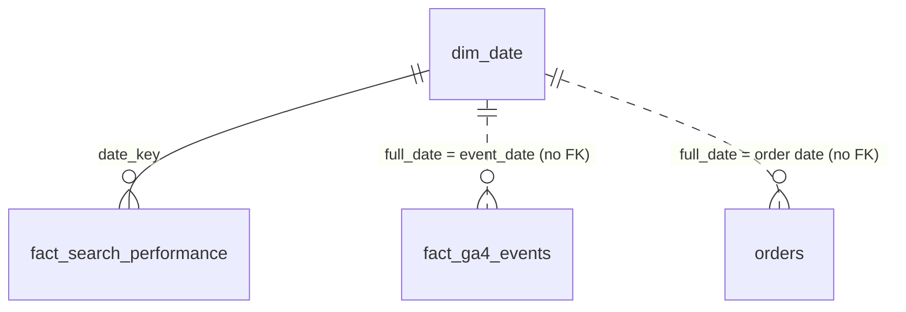

# Table Design

Database schema of the Azure SQL Database `ecommerce-analytics-db`
(server `ecommerce-analytics-sql-2026.database.windows.net`, schema `dbo`).

The database holds three data sources and one shared dimension:

- **WooCommerce** (online shop): customers, products, categories, orders and order items
- **Google Analytics 4** (website tracking): a star schema of events, sessions, users, traffic sources, devices and products
- **Google Search Console** (Google search results): daily search performance per query and page
- **`dim_date`**: a calendar table shared by all data sources

Table definitions live in [`sql/`](../sql/), the load scripts in [`data/`](../data/).

| SQL file | Contents |
|---|---|
| `01_create_tables.sql` | WooCommerce tables |
| `02_alter_tables.sql` | changes to `products`, `customers`, `orders` |
| `03_add_relationships.sql` | WooCommerce foreign keys |
| `04_ga4_tables.sql` | GA4 star schema |
| `05_create_gsc_tables.sql` | Search Console fact table |
| `06_create_dim_date.sql` | `dim_date` (create, fill 2025–2030, foreign keys) |

---

## Overview

| Table | Source | Grain (one row = …) | Primary key | Load script |
|---|---|---|---|---|
| `customers` | WooCommerce orders (billing data) | one customer | `customer_id` | `extract_customers.py` |
| `categories` | WooCommerce product categories | one main category | `category_id` | `extract_categories.py` |
| `subcategories` | WooCommerce product categories | one subcategory | `subcategory_id` | `extract_categories.py` |
| `products` | WooCommerce products | one product | `product_id` | `extract_products.py` |
| `orders` | WooCommerce orders | one order | `order_id` | `extract_orders.py` |
| `order_items` | WooCommerce order line items | one product line in an order | `item_id` | `extract_order_items.py` |
| `dim_users` | GA4 BigQuery export | one GA4 user | `user_key` | planned |
| `dim_traffic_source` | GA4 BigQuery export | one source × medium × campaign × channel | `traffic_source_key` | planned |
| `dim_device` | GA4 BigQuery export | one device × OS × browser × resolution | `device_key` | planned |
| `dim_products` | `products` + `categories` | one product | `product_key` | planned |
| `dim_sessions` | GA4 BigQuery export | one visit | `session_key` | planned |
| `fact_ga4_events` | GA4 BigQuery export | one event (per product for e-commerce events) | `event_key` | planned |
| `fact_search_performance` | Search Console API | one day × query × page × country × device × search type | `search_performance_key` | planned |
| `dim_date` | generated in SQL | one calendar day | `date_key` | `06_create_dim_date.sql` |

---

## Relationships

GA4 star schema:

Search Console and the shared date dimension:

| Foreign key | From | To |
|---|---|---|
| `FK_orders_customers` | `orders.customer_id` | `customers.customer_id` |
| `FK_order_items_orders` | `order_items.order_id` | `orders.order_id` |
| `FK_order_items_products` | `order_items.product_id` | `products.product_id` |
| `FK_subcategories_categories` | `subcategories.category_id` | `categories.category_id` |
| `FK_products_categories` | `products.category_id` | `categories.category_id` |
| `FK_products_subcategories` | `products.subcategory_id` | `subcategories.subcategory_id` |
| `FK_dim_sessions_dim_users` | `dim_sessions.user_key` | `dim_users.user_key` |
| `FK_dim_sessions_dim_traffic_source` | `dim_sessions.traffic_source_key` | `dim_traffic_source.traffic_source_key` |
| `FK_dim_sessions_dim_device` | `dim_sessions.device_key` | `dim_device.device_key` |
| `FK_fact_ga4_events_dim_users` | `fact_ga4_events.user_key` | `dim_users.user_key` |
| `FK_fact_ga4_events_dim_sessions` | `fact_ga4_events.session_key` | `dim_sessions.session_key` |
| `FK_fact_ga4_events_dim_products` | `fact_ga4_events.product_key` | `dim_products.product_key` |
| `FK_fact_search_performance_dim_date` | `fact_search_performance.date_key` | `dim_date.date_key` |

The two models are linked through `dim_products.product_id` (= WooCommerce `products.product_id`)
and, once the shop sends it, `fact_ga4_events.transaction_id` (= WooCommerce order).

### Load order

Because of the foreign keys, the tables must be loaded in this order:

1. `customers`
2. `categories` + `subcategories`
3. `products`
4. `orders`
5. `order_items`

The GA4 tables are loaded in this order:

1. `dim_users`, `dim_traffic_source`, `dim_device`, `dim_products`
2. `dim_sessions`
3. `fact_ga4_events`

`dim_date` is filled by `06_create_dim_date.sql` itself and must exist before
`fact_search_performance` is loaded. Run `05_create_gsc_tables.sql` before `06_create_dim_date.sql`,
because `06` adds the foreign key to the Search Console table.

---

## WooCommerce tables

### `customers`

**Grain:** one row per customer (unique billing email).

WooCommerce guest orders have no customer account,
so customers are derived from the **billing data of the orders** and identified by email.

| Column | Type | Null | Source | Notes |
|---|---|---|---|---|
| `customer_id` | BIGINT | PK | generated | numbered 1, 2, 3 … in order of first appearance |
| `first_name` | NVARCHAR(100) | yes | `billing.first_name` | |
| `last_name` | NVARCHAR(100) | yes | `billing.last_name` | |
| `email` | NVARCHAR(255) | yes | `billing.email` | trimmed and lower-case; used to deduplicate |
| `street` | NVARCHAR(255) | yes | `billing.address_1` | |
| `postal_code` | NVARCHAR(20) | yes | `billing.postcode` | text, so leading zeros are kept |
| `city` | NVARCHAR(100) | yes | `billing.city` | |
| `country` | NVARCHAR(100) | yes | `billing.country` | ISO code, e.g. `DE` |
| `registration_date` | DATETIME2 | yes | `date_created` of the first order | |

### `categories`

**Grain:** one row per main product category.

Main product categories (WooCommerce categories with `parent = 0`).

| Column | Type | Null | Source | Notes |
|---|---|---|---|---|
| `category_id` | BIGINT | PK | `id` | WooCommerce category ID |
| `category_name` | NVARCHAR(255) | no | `name` | HTML entities decoded (`&amp;` → `&`) |

### `subcategories`

**Grain:** one row per product subcategory.

Product subcategories (WooCommerce categories with a parent).

| Column | Type | Null | Source | Notes |
|---|---|---|---|---|
| `subcategory_id` | BIGINT | PK | `id` | WooCommerce category ID |
| `subcategory_name` | NVARCHAR(255) | no | `name` | HTML entities decoded |
| `category_id` | BIGINT | no | `parent` | FK → `categories` |

### `products`

**Grain:** one row per WooCommerce product.

| Column | Type | Null | Source | Notes |
|---|---|---|---|---|
| `product_id` | BIGINT | PK | `id` | WooCommerce product ID |
| `product_name` | NVARCHAR(255) | yes | `name` | HTML entities decoded |
| `brand` | NVARCHAR(100) | yes | `brands[0].name` | |
| `sku` | NVARCHAR(100) | yes | `sku` | empty text stored as NULL |
| `price` | DECIMAL(18,2) | yes | `regular_price` | falls back to `price` for variable products |
| `sales_price` | DECIMAL(18,2) | yes | `sale_price` | NULL if the product is not on sale |
| `stock_quantity` | INT | yes | `stock_quantity` | NULL if stock is not tracked |
| `status` | NVARCHAR(50) | yes | `status` | e.g. `publish`, `draft` |
| `created_at` | DATETIME2 | yes | `date_created` | |
| `category_id` | BIGINT | yes | derived | FK → `categories` |
| `subcategory_id` | BIGINT | yes | derived | FK → `subcategories` |

**Category rule.** A WooCommerce product can have several categories, but the table stores one.
The subcategory is the product's first *product-type* subcategory, and the category is that
subcategory's parent. The marketing collections *Geschenke*, *Neuheiten* and *Uncategorized*
are only used when no other category exists (`collection_category_ids` in `extract_products.py`).

### `orders`

**Grain:** one row per WooCommerce order.

| Column | Type | Null | Source | Notes |
|---|---|---|---|---|
| `order_id` | BIGINT | PK | `id` | WooCommerce order ID |
| `customer_id` | BIGINT | yes | lookup | matched to `customers` by billing email; FK → `customers` |
| `status` | NVARCHAR(50) | yes | `status` | e.g. `completed`, `processing`, `cancelled` |
| `currency` | NVARCHAR(10) | yes | `currency` | e.g. `EUR` |
| `order_created_at` | DATETIME2 | yes | `date_created` | |
| `order_modified_at` | DATETIME2 | yes | `date_modified` | |
| `order_paid_at` | DATETIME2 | yes | `date_paid` | |
| `order_completed_at` | DATETIME2 | yes | `date_completed` | |
| `payment_method` | NVARCHAR(100) | yes | `payment_method` | technical name, e.g. `paypal` |
| `payment_method_title` | NVARCHAR(255) | yes | `payment_method_title` | display name |
| `discount_total` | DECIMAL(18,2) | yes | `discount_total` | |
| `shipping_total` | DECIMAL(18,2) | yes | `shipping_total` | |
| `total_tax` | DECIMAL(18,2) | yes | `total_tax` | |
| `order_total` | DECIMAL(18,2) | yes | `total` | gross order amount |

### `order_items`

**Grain:** one row per product line in an order.

One row per product line of an order (WooCommerce `line_items`).

| Column | Type | Null | Source | Notes |
|---|---|---|---|---|
| `item_id` | BIGINT | PK | `line_items[].id` | |
| `order_id` | BIGINT | no | parent order `id` | FK → `orders` |
| `product_id` | BIGINT | yes | `product_id` | NULL if the product was deleted (WooCommerce sends `0`); FK → `products` |
| `variation_id` | BIGINT | yes | `variation_id` | NULL if the product has no variation |
| `item_name` | NVARCHAR(255) | yes | `name` | product name at the time of purchase |
| `quantity` | INT | yes | `quantity` | |
| `subtotal` | DECIMAL(18,2) | yes | `subtotal` | net amount before discounts |
| `subtotal_tax` | DECIMAL(18,2) | yes | `subtotal_tax` | |
| `item_total` | DECIMAL(18,2) | yes | `total` | net amount after discounts |
| `total_tax` | DECIMAL(18,2) | yes | `total_tax` | |
| `unit_price` | DECIMAL(18,2) | yes | `price` | rounded to 2 decimals |

---

## GA4 tables

The GA4 data is modelled as a **star schema**: one fact table with one row per event,
surrounded by dimension tables that describe who, when, where from, on which device and which product.

Every dimension uses a **surrogate key** (`…_key`, `BIGINT IDENTITY`) generated by SQL Server.
The original GA4 values are kept in the table and protected by a `UNIQUE` constraint,
so the same user, session, source or device cannot be loaded twice.

**Data source.** Event-, session- and user-level data is only available through the
**GA4 → BigQuery export** (property `518947113`), not through the GA4 Data API, which returns
aggregated numbers only. The export collects data from the day it is enabled; there is no history.

### `dim_users`

**Grain:** one row per GA4 user (browser/device).

| Column | Type | Null | GA4 field | Notes |
|---|---|---|---|---|
| `user_key` | BIGINT IDENTITY | PK | generated | |
| `ga_user_id` | NVARCHAR(100) | no | `user_pseudo_id` | unique |
| `first_seen_date` | DATE | yes | `user_first_touch_timestamp` | |
| `country` | NVARCHAR(100) | yes | `geo.country` | |
| `region` | NVARCHAR(100) | yes | `geo.region` | |
| `city` | NVARCHAR(100) | yes | `geo.city` | |

### `dim_traffic_source`

**Grain:** one row per combination of source, medium, campaign and channel group.

| Column | Type | Null | GA4 field | Notes |
|---|---|---|---|---|
| `traffic_source_key` | BIGINT IDENTITY | PK | generated | |
| `source` | NVARCHAR(100) | no | session source | e.g. `google` |
| `medium` | NVARCHAR(100) | no | session medium | e.g. `organic` |
| `campaign` | NVARCHAR(200) | no | session campaign | `(not set)` if none |
| `channel_group` | NVARCHAR(100) | no | default channel group | e.g. Organic Search, Direct, Email |

Unique: `source, medium, campaign, channel_group`.

### `dim_device`

**Grain:** one row per combination of device category, operating system, browser and screen resolution.

| Column | Type | Null | GA4 field | Notes |
|---|---|---|---|---|
| `device_key` | BIGINT IDENTITY | PK | generated | |
| `device_category` | NVARCHAR(50) | no | `device.category` | `desktop`, `mobile`, `tablet` |
| `operating_system` | NVARCHAR(100) | no | `device.operating_system` | |
| `browser` | NVARCHAR(100) | no | `device.web_info.browser` | |
| `screen_resolution` | NVARCHAR(50) | no | – | not part of the BigQuery export, stored as `(not set)` |

Unique: `device_category, operating_system, browser, screen_resolution`.

### `dim_products`

**Grain:** one row per WooCommerce product.

Star-schema version of the WooCommerce products, filled from `products` + `categories`
(no API call needed). The category is stored as a name for easier reporting.

| Column | Type | Null | Source | Notes |
|---|---|---|---|---|
| `product_key` | BIGINT IDENTITY | PK | generated | |
| `product_id` | BIGINT | no | `products.product_id` | unique; GA4 `items.item_id` |
| `sku` | NVARCHAR(100) | yes | `products.sku` | |
| `product_name` | NVARCHAR(255) | yes | `products.product_name` | |
| `category` | NVARCHAR(255) | yes | `categories.category_name` | |
| `brand` | NVARCHAR(100) | yes | `products.brand` | |
| `price` | DECIMAL(18,2) | yes | `products.price` | |

### `dim_sessions`

**Grain:** one row per visit (session) of a user.

| Column | Type | Null | GA4 field | Notes |
|---|---|---|---|---|
| `session_key` | BIGINT IDENTITY | PK | generated | |
| `session_id` | BIGINT | no | `ga_session_id` | unique only together with `user_key` |
| `user_key` | BIGINT | no | lookup | FK → `dim_users` |
| `session_start` | DATETIME2 | yes | `session_start` event timestamp | |
| `session_date` | DATE | yes | derived | |
| `landing_page` | NVARCHAR(400) | yes | first `page_location` | |
| `engagement_time` | INT | yes | sum of `engagement_time_msec` | in seconds |
| `engaged_session` | BIT | yes | `session_engaged` | 1 = engaged |
| `traffic_source_key` | BIGINT | yes | lookup | FK → `dim_traffic_source` |
| `device_key` | BIGINT | yes | lookup | FK → `dim_device` |

Unique: `user_key, session_id`.

### `fact_ga4_events`

**Grain:** one row per GA4 event; e-commerce events with several products get one row per product.

| Column | Type | Null | GA4 field | Notes |
|---|---|---|---|---|
| `event_key` | BIGINT IDENTITY | PK | generated | |
| `event_date` | DATE | no | `event_date` | |
| `event_timestamp` | DATETIME2 | no | `event_timestamp` | |
| `user_key` | BIGINT | no | lookup | FK → `dim_users` |
| `session_key` | BIGINT | yes | lookup | FK → `dim_sessions` |
| `event_name` | NVARCHAR(100) | no | `event_name` | e.g. `page_view`, `add_to_cart`, `purchase` |
| `product_key` | BIGINT | yes | lookup via `items.item_id` | FK → `dim_products` |
| `transaction_id` | NVARCHAR(50) | yes | `ecommerce.transaction_id` | purchase events only |
| `quantity` | INT | yes | `items.quantity` | |
| `value` | DECIMAL(18,2) | yes | `event_value` / item revenue | |
| `currency` | NVARCHAR(10) | yes | `event_value_currency` | e.g. `EUR` |

---

## Search Console tables

Data from the **Google Search Console API** for the URL-prefix property `https://luandla.de/`,
read with the same service account as GA4 (permission *Restricted*, read-only).
Google keeps **16 months** of history, so past data can be loaded right away.

### `fact_search_performance`

**Grain:** one row per day, search query, page, country, device and search type.

| Column | Type | Null | API field | Notes |
|---|---|---|---|---|
| `search_performance_key` | BIGINT IDENTITY | PK | generated | |
| `date_key` | INT | no | `date` | format `YYYYMMDD`; FK → `dim_date` |
| `query` | NVARCHAR(300) | no | `query` | search term, e.g. `donabe topf` |
| `page_url` | NVARCHAR(400) | no | `page` | path only, domain removed, e.g. `/japanese-donabe/` (same format as GA4) |
| `country` | NVARCHAR(3) | no | `country` | ISO 3166-1 alpha-3 in upper case, e.g. `DEU` |
| `device` | NVARCHAR(20) | no | `device` | `DESKTOP`, `MOBILE`, `TABLET` |
| `search_type` | NVARCHAR(20) | no | request parameter `type` | `WEB`, `IMAGE`, `VIDEO`, `NEWS`, `DISCOVER` |
| `impressions` | INT | yes | `impressions` | how often a result was shown |
| `clicks` | INT | yes | `clicks` | how often a result was clicked |
| `ctr` | DECIMAL(7,6) | yes | `ctr` | clicks ÷ impressions, 0 to 1 |
| `average_position` | DECIMAL(9,2) | yes | `position` | 1 = top of Google |

Unique: `date_key, query, page_url, country, device, search_type` (prevents loading a day twice).
The text lengths keep this constraint under SQL Server's 1,700-byte limit for unique keys.

---

## Shared dimension

### `dim_date`

**Grain:** one row per calendar day.

Calendar table used by all data sources. It is generated in SQL (no API) and filled with every
day from **2025-01-01 to 2030-12-31**. To extend it, change `@end_date` in
`06_create_dim_date.sql` and run the file again; existing days are skipped.

| Column | Type | Null | Example | Notes |
|---|---|---|---|---|
| `date_key` | INT | PK | `20260925` | format `YYYYMMDD` |
| `full_date` | DATE | no | `2026-09-25` | unique; join column for tables with a `DATE` column |
| `day_of_month` | TINYINT | no | `25` | |
| `day_of_week` | TINYINT | no | `5` | ISO: 1 = Monday … 7 = Sunday |
| `day_name` | NVARCHAR(20) | no | `Friday` | |
| `is_weekend` | BIT | no | `0` | 1 = Saturday or Sunday |
| `week_of_year` | TINYINT | no | `39` | ISO calendar week |
| `month_number` | TINYINT | no | `9` | |
| `month_name` | NVARCHAR(20) | no | `September` | |
| `year_month` | CHAR(7) | no | `2026-09` | |
| `quarter_number` | TINYINT | no | `3` | |
| `year_quarter` | CHAR(7) | no | `2026-Q3` | |
| `year_number` | SMALLINT | no | `2026` | |

Only `fact_search_performance` has a foreign key to `dim_date`. `fact_ga4_events.event_date` and
`orders.order_created_at` join through `dim_date.full_date`
(for `orders`: `CAST(order_created_at AS DATE)`).

---

## Known limitations

- **GA4 star schema requires the BigQuery export.** The GA4 Data API only returns aggregated data.
  The export starts on the day it is enabled, and the free BigQuery sandbox deletes tables after 60 days.
- **GA4 purchases currently have no transaction ID or revenue.** Until the shop's GA4 tracking sends
  them, `transaction_id` and `value` stay empty and revenue comes from WooCommerce.
- **GA4 counts fewer purchases than WooCommerce** (10 vs. 17), because visitors who decline
  cookies or use ad blockers are not tracked.
- **No `view_item` events** are tracked yet, so product-level events are limited to `add_to_cart` and later steps.
- **Search Console hides rare search queries** for privacy. Rows grouped by `query` therefore add up
  to fewer clicks and impressions than the site totals (977 clicks in total since November 2025).
- **Country codes differ between sources:** Search Console uses `DEU`, WooCommerce `DE` and GA4 `Germany`.
  Comparing countries across sources needs a mapping table.
- **Re-running a load script fails** with a primary-key or unique error, because the rows already exist.
  Incremental loading is planned for the Azure Functions stage.
